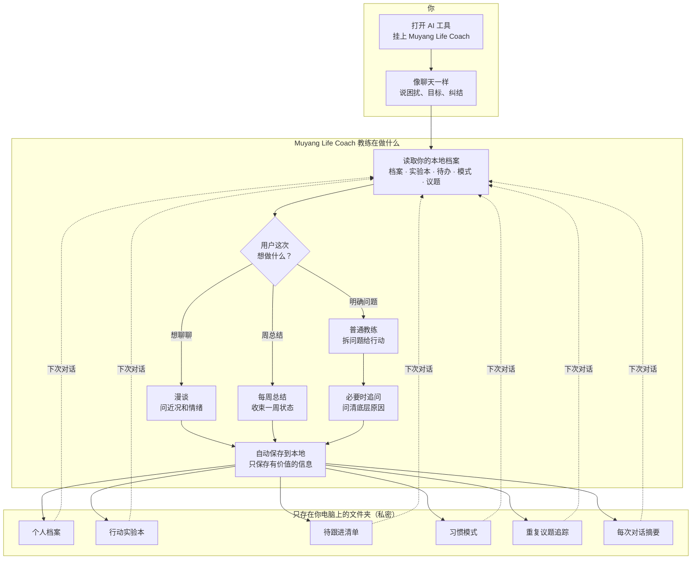
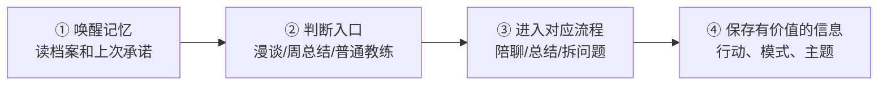

# Muyang Life Coach — 你的 AI 人生教练

**Muyang Life Coach** 是一个给 Cursor、Claude Code、Trae 等 AI 工具用的 **Skill（技能）**。  
装上之后，AI 不再每次从零开始聊天，而是一位始终**记得你是谁、了解你所有的行为和决策、用科学方法帮你行动**的教练。

> 技术安装步骤请看同目录 **[INSTALL.md](./INSTALL.md)**。本文面向**普通用户**，说明它是什么、怎么工作、好在哪里。  
> 作者 GitHub：[@itsMelo](https://github.com/itsMelo)

---

## 怎么开始？

> Skill 的工作区是你的本地文件和 Skill 本身无关，更新 Skill 不会丢任何本地档案。  
> Skill 装在哪：`~/.claude/skills/muyang-life-coach-skill/` 或 `~/.cursor/skills/muyang-life-coach-skill/` · 本地数据放哪：例如 `~/LifeCoach/`（任意文件夹）

### 方式一：一行命令（推荐）

**Claude Code + Cursor 一起装：**

```bash
npx skills add https://github.com/itsMelo/muyang-life-coach-skill --skill muyang-life-coach-skill -g -a cursor -a claude-code -y
```

**仅 Claude Code：**

```bash
npx skills add https://github.com/itsMelo/muyang-life-coach-skill --skill muyang-life-coach-skill -g -a claude-code -y
```

**仅 Cursor：**

```bash
npx skills add https://github.com/itsMelo/muyang-life-coach-skill --skill muyang-life-coach-skill -g -a cursor -y
```

安装后重启 IDE，或新开 Agent 会话。

### 方式二：发给 AI Agent（复制整段）

把下面这段话直接发给 **Cursor / Claude Code**（需有 shell 权限）：

```text
帮我安装 muyang-life-coach-skill skill。

1. 用 git clone 安装到 Claude Code 与 Cursor 的全局 skills 目录（目录不存在则创建）：
   git clone https://github.com/itsMelo/muyang-life-coach-skill.git ~/.claude/skills/muyang-life-coach-skill
   若 ~/.cursor/skills/muyang-life-coach-skill 不存在或与上面不是同一目录，则：
   mkdir -p ~/.cursor/skills
   ln -sfn ~/.claude/skills/muyang-life-coach-skill ~/.cursor/skills/muyang-life-coach-skill
   （若 symlink 不可用，则再 clone 一份到 ~/.cursor/skills/muyang-life-coach-skill）

2. 验证 Skill 安装成功，以下路径必须存在：
   SKILL.md
   references/
   scripts/init-workspace.sh
   VERSION

3. 创建工作区文件夹（与 Skill 目录分开）：
   mkdir -p ~/LifeCoach
   告诉用户：用 IDE 打开 ~/LifeCoach，attach muyang-life-coach-skill，说「我想用 life coach，帮我建档」即可——Skill 会自动初始化工作区，不必手动跑 init-workspace.sh。

4. 告诉我：Skill 装好了、工作区路径是 ~/LifeCoach、当前 VERSION 文件内容。
```

### 方式三：手动命令行

```bash
git clone https://github.com/itsMelo/muyang-life-coach-skill.git ~/.claude/skills/muyang-life-coach-skill
mkdir -p ~/.cursor/skills
ln -sfn ~/.claude/skills/muyang-life-coach-skill ~/.cursor/skills/muyang-life-coach-skill
```

### 第一次使用

1. 新建并用 IDE **打开工作区文件夹**（例如 `~/LifeCoach`，**不是** skill 安装目录）。
2. Attach **muyang-life-coach-skill** skill（Cursor）或在 Claude Code 中确保 skill 已加载。
3. 对 AI 说：**「我想用 life coach，帮我建档」**——回答一些必要问题，让 AI 知道你是谁。
4. 之后像聊天一样即可；可以说 **「周回顾」**、**「检查上次行为」**。

更新 Skill、迁移、FAQ 见 **[INSTALL.md](./INSTALL.md)**。

---

## 它和普通聊天有什么不一样？


| 普通 AI 聊天            | Muyang Life Coach                |
| ------------------- | -------------------------------- |
| 聊完就忘，下次要重新介绍自己      | **本地记住**你的价值观、处境、承诺过的事           |
| 容易给大道理、鸡汤           | 按问题类型选用 **心理学里验证过的方法**（见下文）      |
| 没问题时不知道聊什么          | 可以进入 **漫谈模式**，像朋友一样问近况、观察状态      |
| 一周过去了，状态散在各处        | 可以做 **每周总结**，收束情绪、行动、模式和下周重点     |
| 说话像模板、像客服、AI 味重     | 内置 **humanizer-quick** 终检（长文场景仍可用完整 humanizer） |
| 很少追问「上次那件事做了吗」      | 有 **行动实验记录**，到期会追问结果             |
| 同一烦恼反复聊，AI 可能装第一次听说 | 会记录 **同一件事聊过几次**，第三次会先点破「你又绕回来了」 |


**数据在你自己电脑的一个文件夹里**，不依赖云端「记忆功能」。你换电脑可以拷贝这个文件夹带走。

---

## 核心优势（你能直接感受到的）

### 1. 记住你，并且持续跟进，不容易遗漏

教练会把信息分门别类记在本地（一个你专属的文件夹）：


| 记什么        | 通俗理解                           |
| ---------- | ------------------------------ |
| **个人档案**   | 你是谁、在乎什么、做过哪些重大决定              |
| **行动实验本**  | 每次聊完答应的小行动：做什么、哪天前完成、做完焦虑有没有变化 |
| **待跟进清单**  | 需要等多步的事（例如：约律师、等对方回复）          |
| **习惯模式**   | 你容易拖延、想太多、讨好别人……等反复出现的模式       |
| **人生议题追踪** | 同一件事聊过几次、上次得出了什么结论             |
| **对话记录**   | 每次聊完的简短摘要，方便以后翻                |


**下次打开对话时**，AI 会**先读这些**，再和你聊——所以它会问：「上次那个实验做了吗？」「这件事我们已经聊过两遍了，今天想打破循环还是只想把焦虑说完？」

你也可以说 **「周回顾」**，用大约 15 分钟把本周实验、待办、还在绕的议题过一遍。

### 2. 用科学化的方法指导思考与行动，不是空泛安慰

**先弄清你卡在哪一类问题，再用对应方法，最后必须落到一件可验证的小事上。**

常见框架（都已写进 Skill，AI 按规则选用）：


| 你更像哪种情况         | 用的思路         | 帮你做什么                  |
| --------------- | ------------ | ---------------------- |
| 焦虑、胡思乱想、总往最坏想   | **CBT 认知行为** | 分清「事实」和「脑子里的话」，减少灾难化   |
| 想改又改不动、一直拖延     | **MI 动机访谈**  | 看清「维持现状对你有什么好处」，找回改的动力 |
| 关系痛苦、边界         | **关系模式**     | 看清你在「保护自己」还是「争取连接」     |
| 不想面对某种感受、麻木逃避   | **ACT 接纳承诺** | 少跟情绪硬扛，把精力放到你在乎的方向上    |
| 重大决定（工作、钱、城市）   | **决策脚手架**    | 分清赌注大小，对照你过去类似决定，避免冲动  |
| 迟迟不开始（写作、副业、习惯） | **起步手册**     | 把「怕失败」拆成可承受的小实验        |
| 亏钱、收入、要不要赌一把    | **财务风险**     | 用真实数字算清「最坏大概占你几个月收入」   |


每一类都有**具体问法、具体练法**，结尾通常是下面之一，而不是「加油」：

- **行为实验**：「如果我做 X，我猜会发生 Y」——做完记下来对不对  
- **执行意图**：「当某种情况出现，我就做某事」（带日期）  
- **小步行动**：明天固定时间做 15 分钟，前后给自己的紧张程度打分

聊完还会问一句：**「这个落地方案对你有用吗？」** 没用就继续磨，直到能行动或想通。

### 3. 遇到说不清的事，会先追问，不急着下结论

有些问题不能直接回答。比如：

- 「我是不是还喜欢她？」
- 「我为什么总是不敢拒绝？」
- 「我到底该不该复合 / 换城市 / 离职？」

这种时候，教练不会一上来给建议。它会先问一个窄问题，帮你把脑子里的雾拨开。默认最多追问 3 轮，每轮只问一个主问题。看清楚后，会停下来给判断和行动。

例如：

> 我先不急着回答「你是不是还喜欢她」。这个问题如果直接答，很容易答偏。我想先问一个更具体的问题：你想要的是她这个人，还是她曾经给过你的那种美好的感觉？

教练会尽量让你把答案**直接写到对话里**。这样它才能记住你的原话，下次继续进行分析和回看。

### 4. 没有明确问题时，可以漫谈

你不必每次都带着一个「问题」来。  
如果你只是说「想聊聊」「最近有点乱」「没啥具体问题」，教练会进入漫谈模式。

它会像朋友一样先问近况，再结合你的近期状态轻轻追问。比如：

> 这两天你心里更重要的是哪一块：朋友、感情、工作，还是说不清？

漫谈不会把每句话都归档。只有出现新事实、新模式、新待办，或者一个值得长期跟踪的新主题时，才会写入本地状态。

漫谈的问题也不是固定题库。教练会优先根据你刚说的话、最近的状态、还没闭合的事来问一个具体问题，尽量让你能用一句话答出来。

### 5. 周末可以做每周总结

你可以随时说「周总结」「周回顾」「复盘这周」。  
如果是周六或周日，你只是打开对话打个招呼，教练也可以先问一句要不要做本周总结。

每周总结不只是查待办，它会帮你看：

- 这周发生了什么
- 最重的情绪在哪里
- 看见了什么重复模式
- 做成了哪些事
- 下周只盯哪一件事

---

## 工作原理图（一张图看懂）




---

## 一次对话怎么走？（四步）




**举例**：你说「自媒体一直想发第一条，总拖」。  
教练会结合档案里你的性格模式，可能判断这是「怕认真做就证明自己不行」，用**起步手册**把任务缩成「今晚 300 字 + 一张图」；写入**行动实验本**「5 月 31 日前完成」；下次进来先问「发了没？紧张从几分到几分」。

---

## 同一件事聊第三次，它不会装不知道

同一件事（比如感情、副业、是否离职）如果**已经认真聊过并保存过两次**，第三次你再提起时，教练**不会当作全新问题**，而是类似：

> 「这件事我们已经是第三次坐下来聊了——不是新问题，是**又绕回来了**。上次我们的结论是……今天你想打破循环，还是只想把焦虑说完？」

这句话往往比泛泛安慰更有用，因为它逼你面对：**老模式是不是又在重复**。

---

## 隐私与安全

- 你的故事、收入、关系状况写在**本机文件夹**，不靠「云端」。  
- 若谈到自伤、不想活等危机内容，Skill 要求 AI **停止教练，只提供危机热线**——它不替代专业心理咨询或医疗。

---

## 适合谁用？

- 经常纠结、拖延，想要**可执行的下一步**的人  
- 希望 AI **记得你上次说过什么**的人
- 愿意偶尔做 **周回顾**、兑现小承诺的人

---

## 产品是什么？

**产品就是这个 Skill 文件夹本身**  
用户在自己电脑上长出来的「个人档案 + 实验本 + 对话记录」，是**使用 Skill 之后产生的私有数据**。

---

## 更多说明


| 文档                             | 读者                   |
| ------------------------------ | -------------------- |
| [INSTALL.md](./INSTALL.md)     | 安装、更新、AI 安装话术        |
| [CHANGELOG.md](./CHANGELOG.md) | 版本变更                 |
| [MIGRATION.md](./MIGRATION.md) | 升级后工作区要不要动           |
| `SKILL.md`                     | AI 读的完整工作指令（一般用户不必看） |


如果你愿意，第一次建档后可以试一句：**「我最近最卡的一件事是……」**——体验一下「记得你 + 科学拆解 + 小行动落地」的完整流程。